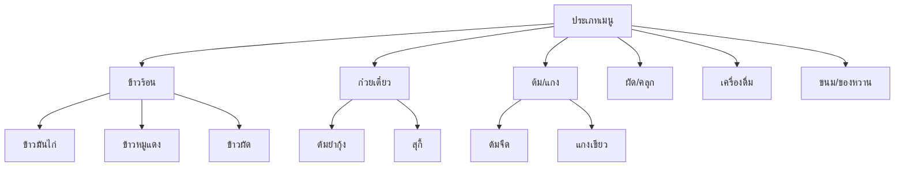
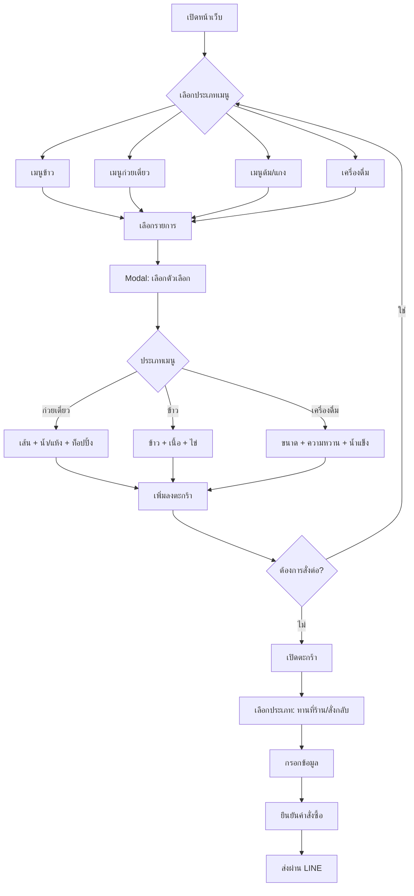

# Restaurant Order System Redesign Plan
# แผนงานการปรับปรุงระบบสั่งอาหารสำหรับร้านอาหารไทย

## 1. สรุปโครงการ

### สถานะปัจจุบัน
- โปรเจกต์เดิม: ร้านก๋วยเตี๋ยว/เปียต้มเลือดหมู
- เมนู: เน้นก๋วยเตี๋ยวเท่านั้น (เส้น + ท็อปปิ้ง)
- ระบบ: สั่งอาหารผ่าน LINE + Admin Dashboard

### เป้าหมายการปรับปรุง
- ขยายเป็นร้านอาหารไทยที่รองรับหลากหลายประเภท
- เมนูแบบ Dynamic ตามประเภทอาหาร
- ระบบ Customize ที่ยืดหยุ่น

---

## 2. ฟีเจอร์ใหม่ที่ต้องพัฒนา

### 2.1 ระบบเมนูแบบยืดหยุ่น (Flexible Menu System)



### 2.2 ระบบตัวเลือกอาหาร (Food Options System)

| ประเภทเมนู | ตัวเลือกหลัก | ตัวเลือกเพิ่มเติม |
|------------|-------------|------------------|
| ก๋วยเตี๋ยว | เส้น, รูปแบบ (น้ำ/แห้ง) | ท็อปปิ้ง, ระดับความเผ็ด |
| ข้าว | ประเภทข้าว, เนื้อ | ไข่ดาว, น้ำพริก |
| ต้ม/แกง | ระดับความเผ็ด | เพิ่มเครื่อง |
| ผัด | ประเภทผัด | ระดับความเผ็ด, ไข่ |
| เครื่องดื่ม | ขนาด, ความหวาน | น้ำแข็ง/ไม่น้ำแข็ง |

---

## 3. โครงสร้างฐานข้อมูลใหม่

### 3.1 Schema หลัก

```typescript
// src/db/schema/menu-new.ts

// ============================================
// Category Groups - กลุ่มประเภทเมนูหลัก
// ============================================
export const categoryGroups = pgTable('category_groups', {
  id: uuid('id').primaryKey().defaultRandom(),
  name: varchar('name', { length: 100 }).notNull(), // "เมนูข้าว", "เมนูก๋วยเตี๋ยว"
  slug: varchar('slug', { length: 50 }).notNull().unique(),
  description: varchar('description', { length: 500 }),
  icon: varchar('icon', { length: 100 }), // Icon name from Lucide
  sortOrder: integer('sort_order').notNull().default(0),
  isActive: boolean('is_active').notNull().default(true),
  createdAt: timestamp('created_at').notNull().defaultNow(),
  updatedAt: timestamp('updated_at').notNull().defaultNow(),
});

// ============================================
// Categories - หมวดหมู่ย่อย
// ============================================
export const categories = pgTable('categories', {
  id: uuid('id').primaryKey().defaultRandom(),
  groupId: uuid('group_id').references(() => categoryGroups.id).notNull(),
  name: varchar('name', { length: 255 }).notNull(), // "ต้มจืด", "ผัดกระเพรา"
  slug: varchar('slug', { length: 50 }).notNull(),
  description: varchar('description', { length: 500 }),
  imageUrl: varchar('image_url', { length: 500 }),
  sortOrder: integer('sort_order').notNull().default(0),
  isActive: boolean('is_active').notNull().default(true),
  createdAt: timestamp('created_at').notNull().defaultNow(),
  updatedAt: timestamp('updated_at').notNull().defaultNow(),
});

// ============================================
// Menu Items - รายการอาหาร
// ============================================
export const menuItems = pgTable('menu_items', {
  id: uuid('id').primaryKey().defaultRandom(),
  categoryId: uuid('category_id').references(() => categories.id).notNull(),
  name: varchar('name', { length: 255 }).notNull(),
  description: text('description'),
  basePrice: decimal('base_price', { precision: 10, scale: 2 }).notNull(),
  imageUrl: varchar('image_url', { length: 500 }),
  isRecommended: boolean('is_recommended').notNull().default(false),
  isSpicy: boolean('is_spicy').notNull().default(false),
  isAvailable: boolean('is_available').notNull().default(true),
  preparationTime: integer('preparation_time').notNull().default(15), // นาที
  calories: integer('calories'),
  allergens: jsonb('allergens'), // Array of allergen strings
  sortOrder: integer('sort_order').notNull().default(0),
  createdAt: timestamp('created_at').notNull().defaultNow(),
  updatedAt: timestamp('updated_at').notNull().defaultNow(),
});

// ============================================
// Menu Option Groups - กลุ่มตัวเลือก (เช่น เส้น, ขนาด)
// ============================================
export const optionGroups = pgTable('option_groups', {
  id: uuid('id').primaryKey().defaultRandom(),
  menuItemId: uuid('menu_item_id').references(() => menuItems.id).notNull(),
  name: varchar('name', { length: 100 }).notNull(), // "เลือกเส้น", "ระดับความเผ็ด"
  slug: varchar('slug', { length: 50 }).notNull(),
  type: varchar('type', { length: 20 }).notNull(), // "single" | "multiple" | "size"
  isRequired: boolean('is_required').notNull().default(false),
  minSelections: integer('min_selections').notNull().default(1),
  maxSelections: integer('max_selections').notNull().default(1),
  sortOrder: integer('sort_order').notNull().default(0),
});

// ============================================
// Menu Options - ตัวเลือกย่อย (เช่น เส้นเล็ก, เส้นใหญ่)
// ============================================
export const menuOptions = pgTable('menu_options', {
  id: uuid('id').primaryKey().defaultRandom(),
  optionGroupId: uuid('option_group_id').references(() => optionGroups.id).notNull(),
  name: varchar('name', { length: 100 }).notNull(),
  priceModifier: decimal('price_modifier', { precision: 10, scale: 2 }).notNull().default('0'),
  isDefault: boolean('is_default').notNull().default(false),
  sortOrder: integer('sort_order').notNull().default(0),
});

// ============================================
// Toppings/Add-ons - ท็อปปิ้งเพิ่มเติม
// ============================================
export const toppings = pgTable('toppings', {
  id: uuid('id').primaryKey().defaultRandom(),
  name: varchar('name', { length: 100 }).notNull(),
  price: decimal('price', { precision: 10, scale: 2 }).notNull(),
  categoryId: uuid('category_id').references(() => categories.id), // Optional - link to category
  imageUrl: varchar('image_url', { length: 500 }),
  isAvailable: boolean('is_available').notNull().default(true),
  createdAt: timestamp('created_at').notNull().defaultNow(),
});

// ============================================
// Menu Item Toppings - ท็อปปิ้งที่ใช้ได้กับเมนู
// ============================================
export const menuItemToppings = pgTable('menu_item_toppings', {
  id: uuid('id').primaryKey().defaultRandom(),
  menuItemId: uuid('menu_item_id').references(() => menuItems.id).notNull(),
  toppingId: uuid('topping_id').references(() => toppings.id).notNull(),
});
```

### 3.2 Orders Schema (ปรับปรุง)

```typescript
// src/db/schema/orders-new.ts

// ============================================
// Order Types
// ============================================
export const orderTypeEnum = {
  dine_in: 'dine_in',
  takeaway: 'takeaway',
  delivery: 'delivery',
} as const;

export const orderStatusEnum = {
  pending: 'pending',         // รอยืนยัน
  confirmed: 'confirmed',     // ยืนยันแล้ว
  preparing: 'preparing',     // กำลังเตรียม
  ready: 'ready',             // พร้อมเสิร์ฟ
  completed: 'completed',     // เสร็จสิ้น
  cancelled: 'cancelled',    // ยกเลิก
} as const;

// ============================================
// Orders
// ============================================
export const orders = pgTable('orders', {
  id: uuid('id').primaryKey().defaultRandom(),
  orderNumber: varchar('order_number', { length: 20 }).notNull().unique(),
  orderType: varchar('order_type', { length: 20 }).notNull().default('takeaway'),
  tableNumber: varchar('table_number', { length: 10 }),
  customerName: varchar('customer_name', { length: 255 }).notNull(),
  customerPhone: varchar('customer_phone', { length: 20 }),
  customerNote: text('customer_note'),
  
  // Pricing
  subtotal: decimal('subtotal', { precision: 10, scale: 2 }).notNull(),
  discount: decimal('discount', { precision: 10, scale: 2 }).notNull().default('0'),
  total: decimal('total', { precision: 10, scale: 2 }).notNull(),
  
  // Status
  status: varchar('status', { length: 20 }).notNull().default('pending'),
  paymentStatus: varchar('payment_status', { length: 20 }).notNull().default('pending'),
  
  // Timestamps
  estimatedReadyTime: timestamp('estimated_ready_time'),
  readyAt: timestamp('ready_at'),
  completedAt: timestamp('completed_at'),
  
  createdAt: timestamp('created_at').notNull().defaultNow(),
  updatedAt: timestamp('updated_at').notNull().defaultNow(),
});

// ============================================
// Order Items - รายการในคำสั่งซื้อ
// ============================================
export const orderItems = pgTable('order_items', {
  id: uuid('id').primaryKey().defaultRandom(),
  orderId: uuid('order_id').references(() => orders.id, { onDelete: 'cascade' }).notNull(),
  menuItemId: uuid('menu_item_id').references(() => menuItems.id).notNull(),
  menuItemName: varchar('menu_item_name', { length: 255 }).notNull(),
  quantity: integer('quantity').notNull(),
  unitPrice: decimal('unit_price', { precision: 10, scale: 2 }).notNull(),
  totalPrice: decimal('total_price', { precision: 10, scale: 2 }).notNull(),
  
  // Selected options (JSON)
  selectedOptions: jsonb('selected_options'),
  // Selected toppings (JSON)
  selectedToppings: jsonb('selected_toppings'),
  // Special request
  specialRequest: text('special_request'),
  
  createdAt: timestamp('created_at').notNull().defaultNow(),
});
```

---

## 4. โครงสร้างหน้าเว็บใหม่

### 4.1 Customer-Facing Pages

```
src/app/
├── page.tsx                          # Landing Page (Redesign)
├── menu/
│   └── page.tsx                      # Full Menu Page (ใหม่)
├── categories/
│   └── [slug]/
│       └── page.tsx                  # Category Page
├── cart/
│   └── page.tsx                      # Cart Page (ใหม่)
├── checkout/
│   └── page.tsx                      # Checkout Page
└── order/
    └── [orderNumber]/
        └── page.tsx                  # Order Status Page
```

### 4.2 Admin Pages (ปรับปรุง)

```
src/app/admin/
├── dashboard/
│   └── page.tsx                      # Dashboard Overview
├── menu/
│   ├── page.tsx                      # Menu Management
│   ├── categories/
│   │   └── page.tsx                  # Category Groups
│   └── items/
│       ├── page.tsx                  # Menu Items List
│       └── [id]/
│           └── page.tsx              # Edit Menu Item
├── orders/
│   ├── page.tsx                      # Orders List
│   └── [id]/
│       └── page.tsx                  # Order Detail
├── analytics/
│   └── page.tsx                      # Reports & Analytics
└── settings/
    ├── page.tsx                      # General Settings
    └── restaurant/
        └── page.tsx                  # Restaurant Profile
```

---

## 5. Component หลักที่ต้องพัฒนา

### 5.1 Customer Components (ใหม่)

| Component | ฟังก์ชัน |
|-----------|----------|
| `CategoryTabs` | แท็บหมวดหมู่แนวนอน (Scrollable) |
| `MenuGrid` | Grid แสดงรายการอาหาร |
| `MenuItemCard` | การ์ดรายการอาหาร |
| `FoodOptionModal` | Modal เลือกตัวเลือกอาหาร (Dynamic) |
| `CartDrawer` | Drawer แสดงตะกร้า |
| `OrderTypeSelector` | เลือกประเภทการสั่ง (ทานที่ร้าน/สั่งกลับ) |
| `PaymentMethod` | เลือกวิธีชำระเงิน |

### 5.2 Food Option Modal (Dynamic)

```typescript
// ตัวอย่าง Dynamic Form ตามประเภทเมนู

interface OptionConfig {
  // ก๋วยเตี๋ยว
  noodleType?: { type: 'single'; options: string[] };
  soupType?: { type: 'single'; options: ['น้ำ', 'แห้ง', 'น้ำตก'] };
  spiceLevel?: { type: 'single'; options: ['ไม่เผ็ด', 'เผ็ดน้อย', 'เผ็ดกลาง', 'เผ็ดมาก'] };
  
  // ข้าว
  riceType?: { type: 'single'; options: ['ข้าวขาว', 'ข้าวกล้อง'] };
  proteinType?: { type: 'single'; options: string[] };
  
  // เครื่องดื่ม
  size?: { type: 'size'; options: ['เล็ก', 'กลาง', 'ใหญ่'] };
  sweetness?: { type: 'single'; options: ['หวานน้อย', 'หวานกลาง', 'หวานมาก'] };
  ice?: { type: 'single'; options: ['ปั่น', 'น้ำแข็งป่น', 'น้ำแข็งเต็ม', 'ไม่ใส่น้ำแข็ง'] };
}
```

---

## 6. แผนการพัฒนา (Development Phases)

### Phase 1: Database & API Foundation ✅ สำเร็จ
- [x] สร้าง Database Schema ใหม่
- [x] สร้าง Seed Data สำหรับทดสอบ
- [x] พัฒนา API สำหรับ Categories & Menu Items
- [x] พัฒนา API สำหรับ Options & Toppings

### Phase 2: Customer Frontend ✅ สำเร็จ
- [x] สร้าง Server Actions สำหรับดึงข้อมูลเมนู
- [x] พัฒนา Dynamic Food Option Modal
- [x] สร้าง Restaurant Menu Section
- [x] ปรับปรุง Cart Store

### Phase 3: Admin Dashboard ✅ สำเร็จ
- [x] สร้าง Admin Server Actions
- [x] สร้าง Admin Menu Management (CRUD)
- [x] สร้าง Admin Category Management

### Phase 4: Polish & Integration ✅ สำเร็จ
- [x] LINE Integration - ปรับปรุงให้รองรับทั้ง legacy และ new format
- [x] Payment Integration - เพิ่ม PromptPay QR พร้อม environment variable
- [x] Performance Optimization - เพิ่ม image optimization และ package imports
- [x] Mobile Responsiveness - ปรับ responsive design ให้ดีขึ้น

---

## สรุปผลการดำเนินงาน

### ✅ Phase 1: Database & API Foundation
- สร้าง Category Groups, Categories, Menu, Toppings, Option Groups schema
- สร้าง API Routes สำหรับทุก entity
- สร้าง Server Actions สำหรับ data fetching

### ✅ Phase 2: Customer Frontend
- สร้าง Restaurant Menu Section
- สร้าง Food Option Modal (dynamic)
- สร้าง Cart Sidebar
- สร้าง Customer Checkout Flow

### ✅ Phase 3: Admin Dashboard
- สร้าง Admin Server Actions
- สร้าง Admin Menu Management (CRUD)
- สร้าง Admin Category Management

### ✅ Phase 4: Polish & Integration
- ปรับปรุง LINE Order URL generation
- เพิ่ม PromptPay QR configuration
- Performance optimization
- Mobile responsiveness improvements

### ✅ Build Fixes (ตุ๊ก!)
- แก้ TypeScript errors ทั้งหมด
- Align types ระหว่าง schema, API, และ components
- เพิ่ม nullable fields ที่จำเป็น

---

## 7. Mermaid: User Flow



---

## 8. Migration Strategy

### จากระบบเดิม → ระบบใหม่

1. **ข้อมูลเมนูเดิม**: สามารถนำเข้าได้โดย Map กับ Category Groups ใหม่
2. **Option Groups**: สร้าง Template สำหรับแต่ละประเภทเมนู
3. **Orders**: เก็บโครงสร้างเดิมไว้สำหรับประวัติ

### ความเข้ากันได้
- รองรับทั้ง Menu แบบเดิม (JSON) และแบบใหม่ (Database)
- Admin สามารถเลือกใช้ Data Source ได้

---

## 9. สรุป

| หัวข้อ | รายละเอียด |
|--------|-----------|
| **ประเภทโปรเจกต์** | Restaurant Order System สำหรับร้านอาหารไทย |
| **Tech Stack** | Next.js 15, TypeScript, Tailwind CSS, Zustand, Drizzle ORM |
| **Database** | PostgreSQL (Neon/Vercel Postgres) |
| **ฟีเจอร์หลัก** | Dynamic Menu Options, Multi-category, Cart & Checkout, Admin Dashboard |
| **การIntegrate** | LINE Notify, PromptPay QR |

---

*Generated: 2026-03-03*
*Last Updated: 2026-03-03*
